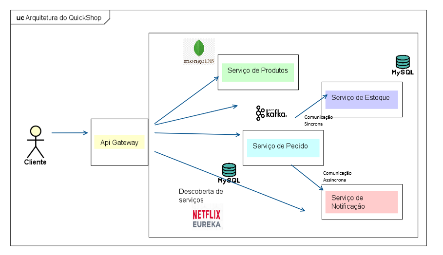

#  QuicksShop Backend Repository
Bem vindo ao repositório do Quickshop 👋, uma pequena aplicação desenvolvida com Spring Boot + Java para aplicar 
conceitos e padrões importantes na criação de microsserviços.

Ao longo dos commits, estarei fazendo comentários detalhados sobre as alterações realizadas no projeto aqui no README.
Vou explicar por que cada alteração é importante para o desenvolvimento e aprimoramento do QuickShop.
Estou à disposição para discussões e esclarecimentos sobre alterações específicas durante o processo de desenvolvimento e revisão.

###  [ Commits: 'First Commit' e 'add docker-compose file' ]

Comecei o projeto organizando a aplicação em três módulos distintos, cada um representando um microsserviço a ser implementado. O primeiro é o **OrderService**, encarregado de lidar com a realização de pedidos. Em seguida, temos o **InventoryService**, responsável por verificar a disponibilidade de produtos no estoque. Por fim, o terceiro módulo é o **ProductService**, que atuará como um catálogo para consultar informações sobre todos os produtos na aplicação.

Além disso, criei o arquivo **docker-compose** para executar os containeres com as instâncias do MySQL e MongoDB que estão sendo utilizadas. Isso demonstra a versatilidade do emprego de microsserviços, uma vez que, além de possuírem bases de dados distintas, operam com sua própria instância de dados.

###  [ Commits: 'product-service implementation' ]

Desenvolvi as funcionalidades para salvar e consultar produtos no documento "produto" do Mongo.

Além disso, desenvolvi um teste de integração para verificar se a criação de um produto ocorre com sucesso. Para realizar esse teste, utilizei a biblioteca Testcontainers. Essa biblioteca é uma ferramenta em Java que simplifica a escrita de testes de integração. Essa biblioteca possibilita a utilização de instâncias temporárias de bancos de dados e qualquer outra imagem por meio de contêineres Docker externos. Essa abordagem proporciona uma forma flexível e eficaz de realizar testes de integração em nossos projetos.

###  [ Commits: 'order-service implementation' ]

Desenvolvi as entidades para as tabelas **pedido** e **detalhe** no OrderService. A tabela detalhe armazena detalhes sobre um pedido.

###  [ Commits: 'inventory-service implementation' ]

Desenvolvi duas funcionalidades: uma destinada a **verificar a disponibilidade de um produto no estoque** e outra voltada para a **atualização da quantidade disponível de produtos**.  Esta última é baseada em uma requisição que indica a nova quantidade associada a cada código de produto no estoque.

Para viabilizar essas funcionalidades, introduzi a interface **DecrementEstoqueUseCase** . Essa interface desempenha um papel essencial ao possibilitar a atualização do estoque com as novas informações fornecidas.  Essa abordagem oferece flexibilidade, permitindo ajustar a implementação da atualização do estoque sem a necessidade de modificar diretamente o código já desenvolvido.

Esse é um princípio conhecido como o **"Princípio do Aberto/Fechado"** que estabelece que as classes devem ser fechadas para modificações e abertas para extensões. Esse conceito sugere que, ao adicionar novas funcionalidades a um sistema, isso deve ser feito sem modificar o código-fonte existente. Em vez disso, a extensão ocorre por meio da introdução de novas classes ou módulos, mantendo a integridade das implementações existentes.

###  [ Commits: 'order-service > inventory-service' communication' ]

Em um sistema distribuído, a comunicação é uma condição essencial. Neste commit, estabeleci a comunicação entre o serviço de pedidos e o serviço de estoque.

No Spring, podemos estabelecer a comunicação entre microsserviços tanto de maneira síncrona quanto assíncrona. Estabelecemos essa comunicação com a inclusão da biblioteca  biblioteca **WebFlux**. E nos dá acesso a classe **WebClient**, que é responsável por fazer requisições ao serviço de estoque.

Também, consertei o RequestMapping dos serviços, pois estavam todos estavam apontando para "/api/produto".

###  [ Commits: 'add eureka/netflix service discovery server' ]

Ao executar uma aplicação Spring Boot, é comum ter várias instâncias do mesmo serviço, com as portas atribuídas aleatoriamente. Para acessar essas novas portas, a solução é empregar um **'service-discovery server'** para registrar nossos serviços. Cada serviço se registra nesse servidor, solicitando uma cópia atualizada dos registros para efetuar requisições.

Nesse commit, implementei o serviço de descoberta **Eureka/Netflix**.

###  [ Commits: 'add api-gateway pattern' ]

O padrão arquitetural do **API Gateway** desempenha um papel fundamental como ponto de entrada para as solicitações em nossa aplicação. Ele assume a responsabilidade de receber e encaminhar essas requisições para seus destinos apropriados, com base nos caminhos (Path) fornecidos pela URI. Embora apresente uma variedade de utilidades, neste projeto, seu principal propósito é simplificar o acesso às APIs.

Dada a execução simultânea de vários microsserviços, optei por manter a maioria dos roteamentos como comentários, mantendo apenas o "product-service" como configuração padrão no arquivo application.properties. Essa abordagem visa aprimorar a clareza e a simplicidade na gestão das solicitações em um ambiente complexo de microsserviços.

###  [ Commits: 'Arquitetura orientada a eventos usando Kafka' ]

Para desenvolvermos **arquiteturas orientadas a eventos**, precisamos utilizar ferramentas que permitam a **comunicação assíncrona** entre microsserviços. De maneira resumida, o **Apache Kafka** nos possibilita criar eventos que são enviados de um produtor (quem emite os eventos) para um consumidor (quem consome esses eventos). Quem facilita essa comunicação é um servidor de Streaming de dados chamado **Broker**.

Nesse commit, alterei um pouco o **serviço de pedidos**, para, assim que um pedido fosse realizado com sucesso, ele transmitisse um *evento assíncrono* para *NotificationService*. Esse serviço, que não foi completamente implementado, vai notificar de alguma forma o usuário mais adiante em outros commits. Por enquanto, ele está apenas fazendo um simples log.

###  [ Commits: 'Arquitetura dos microsserviços' ]
A imagem abaixo ilustra bem tudo que usamos até essa parte do projeto. Pode-se ver que o ator cliente interage diretamente com *Api Gateway*, que redireciona a chamada para o serviço escolhido dependendo do *Path* passado. A seguir, temos a instância do **serviço de produto** com o *MongoDB*, a instância do **serviço de estoque** com o *MySQL* e a instância do **serviço de Pedido** com outra instância do *MySQL*.

O microsserviço pedido se comunica com o de Estoque de forma síncrona usando WebClient. Além disso, o microserviço de pedido também se comunica com a **microsserviço de Notificação** assincronamente com *Kafka*. Por fim, o *Netflix/Eureka* fornece um registro de todas as portas geradas na aplicação para os microsserviços que se inscreveram nele.

